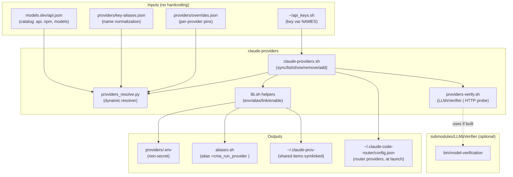
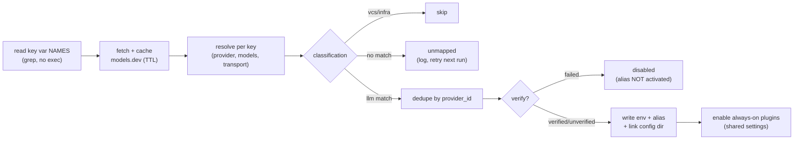
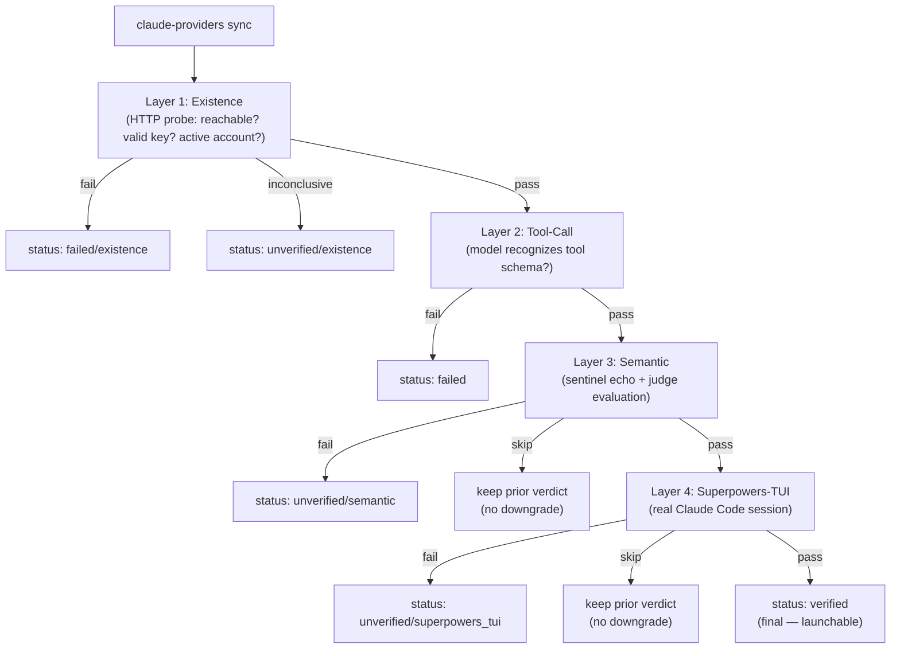
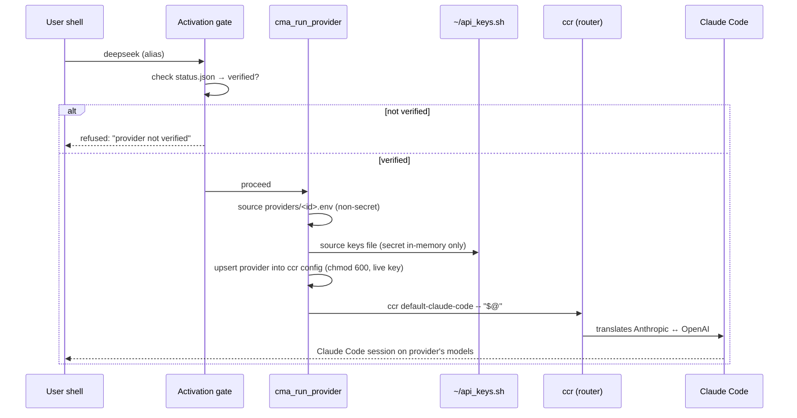

# Provider Aliases — Diagrams

Mermaid sources for the `claude-providers` feature. Render with any Mermaid
tool (e.g. `mmdc`, the GitHub viewer, or the doc export pipeline).

## 1. Component architecture

## 2. `sync` pipeline

## 3. Verification pipeline (4 layers)

## 4. Launch data flow (`cma_run_provider`)

## See also

- [`quota-limits-flow.mmd`](quota-limits-flow.mmd) / [`.svg`](quota-limits-flow.svg) — the `quota`/`limits` reporting flow (a separate, read-only concern from the diagrams above; see the Provider Aliases User Guide §14).
